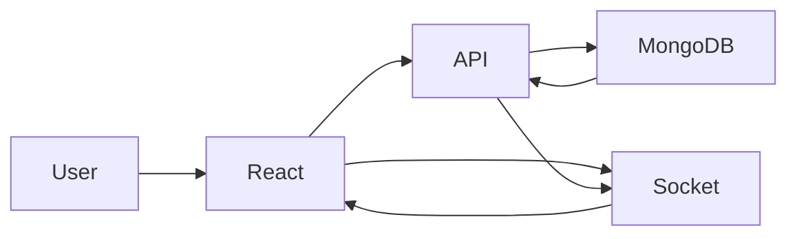
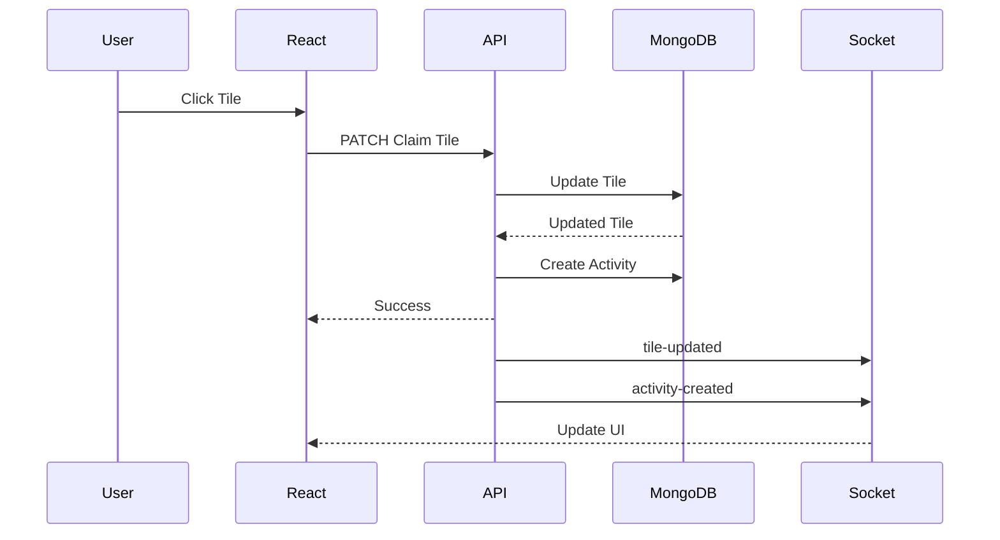
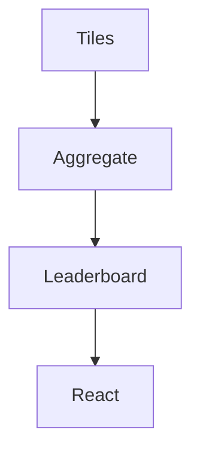
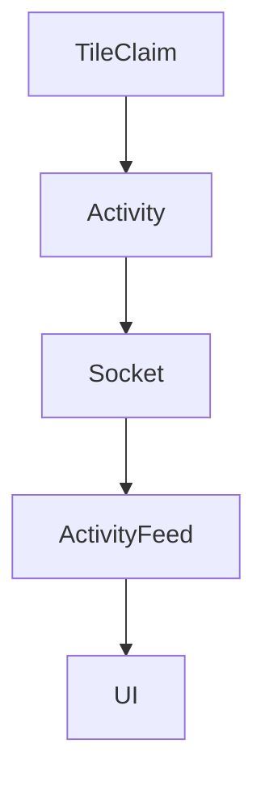
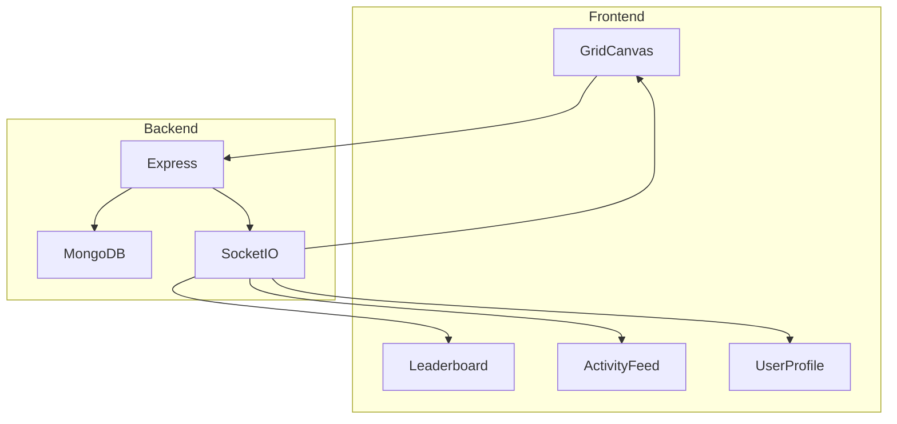

# Shared Grid

A real-time multiplayer pixel grid built with React, Vite, TypeScript, Tailwind CSS, Shadcn UI, Express, MongoDB, Socket.IO, and TanStack Query.

Users can join the grid, choose a username, claim tiles with their color, compete on the leaderboard, and watch activity updates happen in real time.

---

## Features

### Core Features

- Real-time multiplayer grid
- 2500 tiles (50 × 50)
- Username onboarding
- Unique user color generation
- Tile claiming
- Tile ownership protection
- Online users counter
- Leaderboard
- User profile stats
- Recent activity feed
- Real-time Socket.IO updates
- Responsive UI
- Zoom & Pan canvas

### UX Features

- Hover tile details
- Activity feed updates instantly
- Mobile responsive layout
- Shadcn UI components
- Motion animations
- Dark mode ready

---

# Tech Stack

## Frontend

- React 19
- Vite
- TypeScript
- Tailwind CSS v4
- Shadcn UI
- TanStack Query
- Axios
- Socket.IO Client
- Motion

## Backend

- Node.js
- Express
- TypeScript
- MongoDB
- Mongoose
- Socket.IO

---

# Project Structure

```text
shared-grid
│
├── client
│   ├── src
│   │   ├── components
│   │   ├── hooks
│   │   ├── lib
│   │   ├── pages
│   │   ├── types
│   │   └── App.tsx
│   │
│   └── package.json
│
└── server
    ├── src
    │   ├── db
    │   ├── models
    │   ├── routes
    │   ├── services
    │   ├── sockets
    │   └── index.ts
    │
    └── package.json
```

---

# Getting Started

## Clone Repository

```bash
git clone <repo-url>

cd shared-grid
```

---

## Backend Setup

```bash
cd server

pnpm install
```

Create `.env`

```env
PORT=5000

CLIENT_URL=http://localhost:3000

MONGODB_URI=mongodb://localhost:27017/shared-grid
```

Run server:

```bash
pnpm dev
```

---

## Frontend Setup

```bash
cd client

pnpm install
```

Create `.env`

```env
VITE_API_URL=http://localhost:5000/api

VITE_SOCKET_URL=http://localhost:5000
```

Run frontend:

```bash
pnpm dev
```

---

# Gameplay

1. Open application
2. Enter username
3. Receive random color
4. Click a tile
5. Tile becomes yours forever
6. Other users cannot claim it
7. Earn leaderboard ranking
8. Watch activity feed update live

---

# Database Models

## Tile

```ts
{
  tileId: number;
  ownerId: string | null;
  ownerName: string | null;
  color: string | null;
  claimedAt: Date | null;
}
```

---

## Activity

```ts
{
  tileId: number;
  ownerId: string;
  ownerName: string;
  color: string;
}
```

---

# REST API

## Health

```http
GET /health
```

---

## Get Tiles

```http
GET /api/tiles
```

---

## Claim Tile

```http
PATCH /api/tiles/:tileId/claim
```

Body

```json
{
  "ownerId": "123",
  "ownerName": "Praveen",
  "color": "#b518c7"
}
```

---

## Leaderboard

```http
GET /api/stats/leaderboard
```

---

## User Stats

```http
GET /api/stats/user/:userId
```

---

## Activities

```http
GET /api/activities
```

Returns latest 5 activities.

---

## Reset Game

```http
DELETE /api/admin/reset
```

Deletes:

- All activities
- All tile ownership

Reseeds:

- 2500 fresh tiles

Broadcasts:

```txt
game-reset
```

socket event

---

# Socket Events

## Client → Server

```txt
connection
disconnect
```

---

## Server → Client

### Tile Updated

```txt
tile-updated
```

---

### Activity Created

```txt
activity-created
```

---

### Online Count

```txt
online-count
```

---

### Game Reset

```txt
game-reset
```

---

#  Data Flow



---

# Tile Claim Flow



---

# Leaderboard Flow



---

# Activity Feed Flow



---

# Current Architecture

